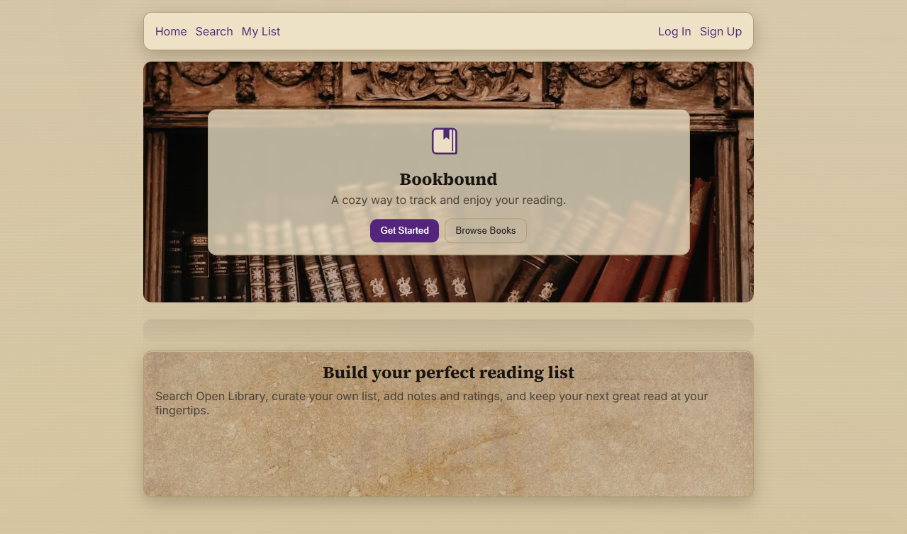
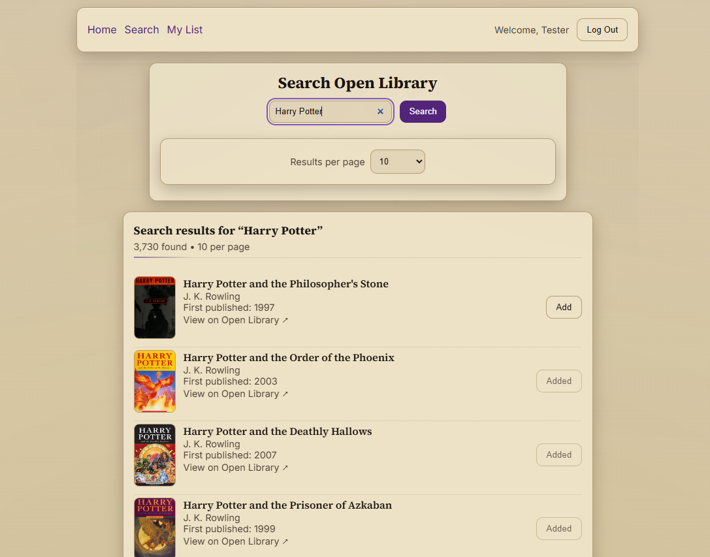
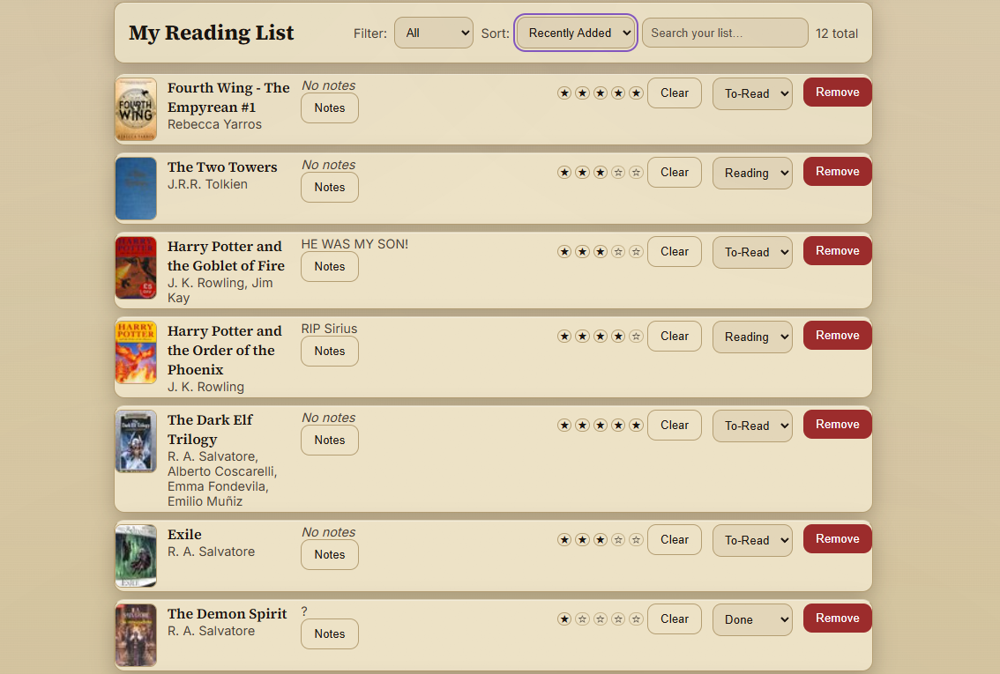

# Bookbound 📚✨  

_A cozy, modern reading tracker app inspired by a love of books and clean design._

---

## 🌟 Overview
**Bookbound** is a full-stack MERN application that helps readers keep track of what they want to read, what they’re currently reading, and what they’ve finished. With an inviting, book-themed design, it integrates directly with the **Open Library API** to make discovering and managing books effortless.

---

## ✨ Features
- 🔍 **Search Open Library** — instantly look up books by title, author, or keywords  
- ➕ **Personal Reading List** — add, track, and remove books with status  
- ⭐ **Ratings & Notes** — leave reflections on your books  
- ❤️ **Favorites** — curate a list of your top reads  
- 📱 **Mobile-Friendly** — responsive, modern UI styled with a cozy reading vibe  
- 🔐 **Auth (JWT)** — secure sign-up and login for personalized lists  

---

## 🖼️ Screenshots
- **Landing Page**


- **Search** 


- **Reading List**


---

## 🛠️ Technologies
[](#)  
### Frontend
- React + Vite  
- React Router  
- CSS
- HTML

### Backend
- Node.js + Express  
- MongoDB + Mongoose  
- JWT Authentication (jsonwebtoken, bcrypt)  

### Other
- Open Library API (book data + covers)  
- Heroku (deployment)  
- Morgan, dotenv, Helmet, CORS  

---

### 🔮 Future Improvements
- 📖 Book categories & tags
- 👥 Social features (share lists, follow friends)
- 📊 Reading stats & progress tracker
- 📅 Calendar / reading schedule integration
- ❌ Error message when Openlibrary API down
- 🪖 Add cloudflare to CSP to remove console error

---
## Try It Here!

[](https://bookboundreading-5ed841923673.herokuapp.com/)  

---

## 🚀 Getting Started
1. **Clone the repo**
   ```
   git clone https://github.com/Xugknight/bookbound.git
   cd bookbound
   ```
2. **Install Dependencies**
    ```
    npm install
    npm --prefix ./frontend install
    ```

3. **Create a ```.env``` file in the project root:**
    ```
    MONGODB_URI=your_mongodb_uri
    SECRET=your_session_secret
    ```

4. **Run Locally**
    ```
    npm run build(npm run dev)     # build frontend
    npm start         # start Express backend
    ```

5. **Open http://localhost:3000🎉**

    ---